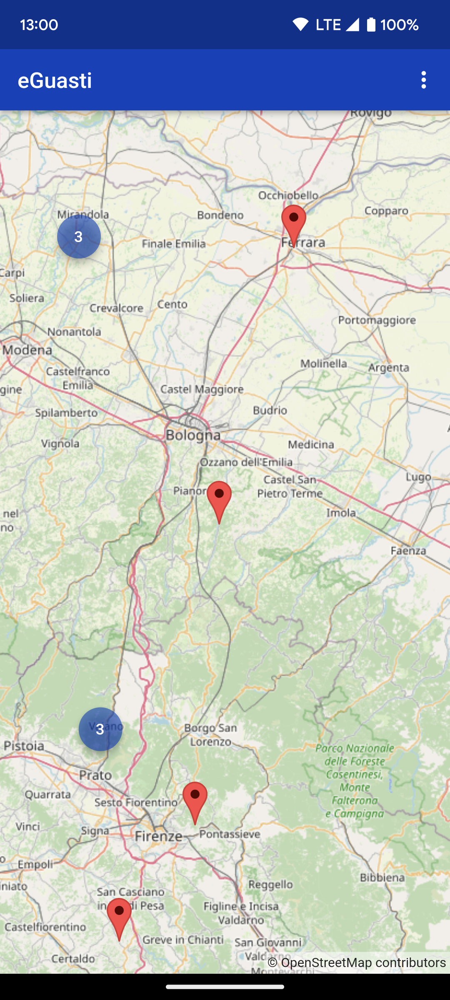
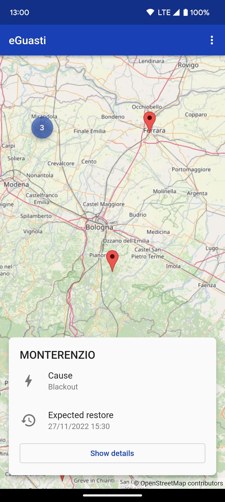

# eGuasti

Android app that shows blackouts and scheduled maintenances on the electric power distribution network managed by e-distribuzione.\
This app does not report outages in Valle d'Aosta and Trentino Alto Adige as those rely on different distributors.

### Screenshots

 
